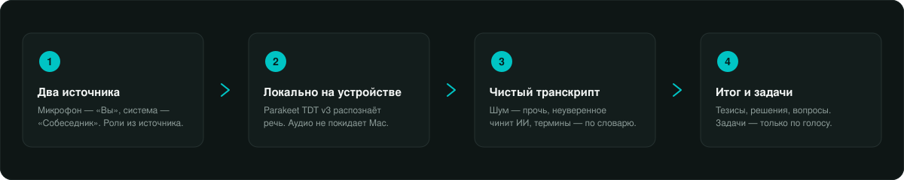
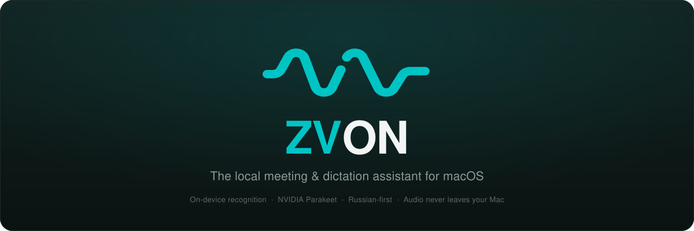
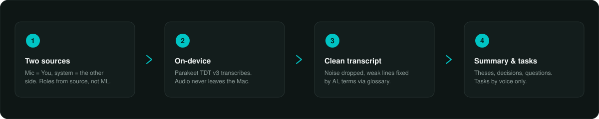

# ZVON

<p align="center"><sub>🌐 &nbsp;Русский открыт ниже&nbsp; · &nbsp;click “English” to expand the English version — right here, no page jump</sub></p>

<!-- ======================= РУССКИЙ ======================= -->
<details open>
<summary><b>🇷🇺&nbsp; Русский</b></summary>

<p align="center">
  
</p>

**Нативный macOS-ассистент для встреч и голосового ввода. Русский язык в приоритете, распознавание — на устройстве.**

ZVON слушает встречу с двух источников сразу — ваш микрофон и системный звук собеседника — и превращает разговор в живой транскрипт, тезисы и задачи. Отдельным горячим клавишем работает push-to-talk диктовка в стиле Wispr Flow: удерживаете клавишу, говорите, отпускаете — текст вставляется прямо в курсор. Речь распознаётся **полностью локально** (Parakeet TDT v3 через FluidAudio, CoreML на Apple Silicon); наружу — к вашему LLM-эндпоинту — уходят только производные тексты, и то лишь если вы его настроите.

<p align="center">
  
</p>

### ✦ Что это

ZVON — это одно окно и один плавающий виджет, закрывающие весь путь встречи:

- **Запись с ролями** — микрофон помечается как «Вы» (`Speaker.me`), системный звук как «Собеседник» (`Speaker.them`). Роли берутся из источника, а не из нейросетевой диаризации, поэтому разделение на двоих участников **100% точное**.
- **Живой транскрипт** — распознавание на устройстве, финальные строки + партиалы по каждому спикеру, глобальная временная шкала переживает паузу/возобновление.
- **✦ Итог** — LLM собирает тезисы, решения и темы (но **не** задачи).
- **Задачи только по голосу** — задача появляется, только когда вы произнесли триггер; никакой фоновой генерации из саммари.
- **Диктовка** — глобальный хоткей, вставка в курсор, опциональная AI-причёска текста.
- **Команды голосом** — «открой почту» / «запусти VPN» → сайт (в браузере по умолчанию), приложение или Shortcut. Реестр алиасов в отдельной вкладке, матч локальный и мгновенный.
- **Словарь, рецепты, вопросы по встрече и по всему архиву.**

> Целевой продукт собирается как **`ZVON.app`** (`PRODUCT_NAME=ZVON`), хотя проект и схема XcodeGen называются `Parley`, а bundle id — `com.parley.app`. Marketing version `0.1.0`, минимум macOS `14.0`.

### ✦ Ключевые возможности

| Раздел | Что делает | Настройка (по умолч.) |
|---|---|---|
| **Встречи** | Двухисточниковая запись (mic + system audio), роли Вы/Собеседник, live-метр по микрофону (у системного источника уровень не снимается), пауза/возобновление. | `captureMode = .micOnly` |
| **Диктовка** | Push-to-talk (`.hold`) или `.toggle`, сборка `.me`-финалов, вставка в курсор через `TextInserter`, история 100 сниппетов, счётчик слов за всё время. | hold-режим |
| **Итог / заметки** | `MeetingNotes`: `summary` (до 15 буллетов), `decisions`, `topics`. Язык транскрипта, `temp 0.15`, `max 1600` токенов, одна ремонтная ретрай-попытка на битый JSON. | `summariesEnabled = on` |
| **Задачи** | Создаются **только** по произнесённому стему из вашей речи, вопрос с `?` вето, LLM-гейт `parseTask` подтверждает. Кросс-митинговый агрегатор, экспорт в Markdown и Apple Reminders. | `taskExtractionEnabled = on` |
| **Словарь** | Локальная детерминированная коррекция (точный маппинг вариантов, regex фраз, fuzzy: транслит + Левенштейн ≥ 0.86) + инъекция канонических терминов в LLM-промпт как DATA. | `correctionEnabled = on` |
| **Рецепты** | Сохранённые prompt-линзы над материалами встречи: Письмо-follow-up, Протокол, Тезисы в Telegram, Черновик ТЗ/PRD, Разбор звонка. Кастомные рецепты, `temp 0.35`. | 5 встроенных |
| **Вопросы** | `ask()` (⌘K) — строго по текущей встрече, «честно скажи» если ответа нет. `askArchive()` — по всему архиву через keyword+recency (без эмбеддингов), один LLM-вызов с цитированием источника. | — |
| **Команды** | Голосом «открой …/запусти …» → открыть сайт (браузер по умолчанию) / приложение / Shortcut. Реестр алиасов, детерминированный локальный матч (без LLM), срабатывает только на короткой реплике с глаголом-первым-словом. | вкладка «Команды» |

**AI-причёска диктовки** (`aiDictationEnabled`, **выключена** по умолчанию): `polishDictation` убирает слова-паразиты, применяет устные самокоррекции и команды удаления, переводит проговорённую пунктуацию в символы, нормализует числа/проценты/деньги/время (`250 000 ₽`, `15 %`, `15:00`). Жёсткий таймаут **6 c** — при срыве возвращается сырой текст, диктовка никогда не виснет.

### ✦ Как это работает

`SpeechPipeline` слушает два аудиопотока — микрофон («Вы») и системный звук («Собеседник»), — нарезает речь на высказывания собственным energy-VAD и распознаёт каждое локально через Parakeet. Слабые по уверенности фразы отсеиваются как шум или чинятся ИИ; итог и задачи собираются поверх чистого транскрипта.

<p align="center">
  
</p>

- **Роли из источника, не из ML** — разделение на двоих участников всегда точное, без диаризации.
- **Аудио никогда не покидает Mac** — распознаётся на устройстве; наружу уходит только текст, и только если подключён LLM.
- **Умный, а не тяжёлый** — VAD и шумовой фильтр работают на чистой энергии сигнала; ИИ зовётся точечно, лишь для неуверенных фраз.

### ✦ Приватность и безопасность

- **Распознавание — 100% локально.** Единственный исходящий `URLSession` во всём `Sources/` — это `LLMClient.swift`. Декод-путь Parakeet сетевых вызовов не делает.
- **Бот в звонок не заходит.** Звук собеседника снимается локально через Core Audio process tap (`isPrivate=true`) в приватном aggregate-девайсе — TCC-разрешение **«System Audio Recording»**, а не Screen Recording.
- **Наружу уходит только LLM-шаг.** Провайдеры: OpenAI, Anthropic, локальный Ollama, Hugging Face, custom. Поставляется **без** встроенного эндпоинта. Пустой эндпоинт → ничего не покидает устройство.
- **Ключи — только в Keychain** (`kSecClassGenericPassword`, `kSecAttrAccessibleWhenUnlocked`), не в UserDefaults / plists / БД.
- **Секрет на проводе только по https/loopback** — ключ не уйдёт открытым текстом на удалённый host.
- **Защита от prompt-injection всюду.** Ненадёжный контент фенсится тегами `<transcript>` / `<meeting>` / `<archive>` / `<glossary>` как ДАННЫЕ, не инструкции; длина зажата как анти-DoS.
- **Задачи — только из вашей речи** (`if speaker == .me`), удалённый участник не подсунет задачу.
- **Ноль телеметрии.** Никаких analytics/sentry/firebase. Продиктованный текст в буфере помечается `ConcealedType + TransientType`, прежний буфер восстанавливается после вставки.

> **Честные оговорки.** ATS полностью открыт (`NSAllowsArbitraryLoads=true`) ради cleartext-HTTP к самохостному LLM. Приложение работает без App Sandbox и без Hardened Runtime (прямая раздача, self-signed `Parley Dev Cert`). При выборе облачного провайдера производный текст встречи уходит на его эндпоинт по https — это единственная граница приватности; аудио не уходит никогда.

### ✦ Стек и архитектура

| Слой | Технология |
|---|---|
| UI | SwiftUI + AppKit (`NSPanel`, `NSStatusItem`, композитный menu-bar) |
| STT | **NVIDIA Parakeet TDT v3** через **FluidAudio** `≥ 0.12.4` (CoreML, мультиязычный вкл. русский, ~200× realtime) |
| Захват аудио | WhisperKit `AudioProcessor` (микрофон) + Core Audio process tap (система) |
| Хоткеи | KeyboardShortcuts `≥ 1.9.0` |
| LLM | актор `LLMClient` — OpenAI-совместимый + Anthropic; таймаут 45 с, ретрай 3× с backoff |
| Сборка | XcodeGen (`project.yml` → `Parley.xcodeproj`) |

WhisperKit — SPM-зависимость, но **не** живой транскрайбер: рантайм-движок это Parakeet (WhisperKit только захватывает микрофон и даёт опциональный загрузчик Whisper-моделей). Бэкенд вычислений не фиксируется в коде — `AsrManager(config: .default)` оставляет выбор compute-юнита на FluidAudio. Мульти-провайдер `LLMProvider`: `openai · anthropic · local · hf · custom`. Toolchain — 6.2 в language mode 5 (чтобы ослабить strict concurrency).

### ✦ Сборка и запуск

**Требования:** macOS `14.0+` (системный захват собеседника — `14.2+`), Apple Silicon рекомендуется, Xcode + `brew install xcodegen`.

```bash
# 1. Сгенерировать проект (.xcodeproj в .gitignore)
xcodegen generate

# 2. Собрать (схема — Parley, продукт — ZVON.app)
xcodebuild -project Parley.xcodeproj -scheme Parley \
  -configuration Debug -derivedDataPath .build/dd build
# → .build/dd/Build/Products/Debug/ZVON.app
```

Подпись — стабильная self-signed `Parley Dev Cert`, чтобы TCC-гранты не переспрашивались при пересборке. Модель скачивается автоматически при первом использовании (~1,2 ГБ, через HuggingFace-кеш FluidAudio). Первый запуск запрашивает микрофон + Accessibility.

### ✦ Статус и дорожная карта

**Версия `0.1.0`, фаза 0** — прямая раздача, без App Sandbox. Ещё не сделано: ребренд `Parley → ZVON` не доведён (проект/схема/bundle/серт всё ещё `Parley`; `scripts/package-dmg.sh` хардкодит `Parley.app`); метки времени у тезисов Итога не реализованы; легаси-код одно-панельной вёрстки остаётся в `MeetingView`; тест-таргета нет; ATS открыт процессно. История имён — `Parley → Granula → ZVON` — видна в артефактах билдов; текущему `project.yml` соответствует только `ZVON.app`.

### ✦ Бренд

Знак, иконка, цвет, шрифт и все SVG-ассеты — в [**брендбуке**](docs/BRANDBOOK.md).

</details>

<!-- ======================= ENGLISH ======================= -->
<details>
<summary><b>🇬🇧&nbsp; English</b></summary>

<p align="center">
  
</p>

**A native macOS assistant for meetings and voice input. Russian-first, with recognition that runs on your device.**

ZVON listens to a meeting from two sources at once — your microphone and the system audio of the other side — and turns the conversation into a live transcript, key points and tasks. A separate hotkey drives Wispr-Flow-style push-to-talk dictation: hold the key, speak, release — the text is inserted right at your cursor. Speech is recognised **entirely locally** (Parakeet TDT v3 via FluidAudio, CoreML on Apple Silicon); only the derived text ever leaves the machine — to your LLM endpoint, and only if you configure one.

<p align="center">
  
</p>

### ✦ What it is

ZVON is one window and one floating widget that cover the whole arc of a meeting:

- **Recording with roles** — the microphone is tagged as “You” (`Speaker.me`), system audio as “The other side” (`Speaker.them`). Roles come from the source, not from neural diarization, so the split between two participants is **100% exact**.
- **Live transcript** — on-device recognition, final lines + partials per speaker, a global timeline that survives pause/resume.
- **✦ Summary** — the LLM assembles theses, decisions and topics (but **not** tasks).
- **Tasks by voice only** — a task appears only when you say a trigger; no ambient generation from the summary.
- **Dictation** — a global hotkey, insert-at-cursor, optional AI cleanup of the text.
- **Voice commands** — “открой почту” / “запусти VPN” → open a site (in the default browser), an app, or a Shortcut. An alias registry in its own tab; matching is local and instant.
- **Glossary, recipes, questions about the meeting and across the whole archive.**

> The shipped product builds as **`ZVON.app`** (`PRODUCT_NAME=ZVON`), even though the XcodeGen project and scheme are named `Parley` and the bundle id is `com.parley.app`. Marketing version `0.1.0`, minimum macOS `14.0`.

### ✦ Key features

| Area | What it does | Setting (default) |
|---|---|---|
| **Meetings** | Two-source recording (mic + system audio), You/The-other-side roles, a live level meter on the microphone (the system-audio side reports no energy), pause/resume. | `captureMode = .micOnly` |
| **Dictation** | Push-to-talk (`.hold`) or `.toggle`, assembles `.me` finals, inserts at cursor via `TextInserter`, 100-snippet history, lifetime word count. | hold mode |
| **Summary / notes** | `MeetingNotes`: `summary` (up to 15 bullets), `decisions`, `topics`. Transcript language, `temp 0.15`, `max 1600` tokens, one repair retry on malformed JSON. | `summariesEnabled = on` |
| **Tasks** | Created **only** from a spoken stem in your own speech, a trailing `?` vetoes it, an LLM `parseTask` gate confirms. Cross-meeting aggregator, export to Markdown and Apple Reminders. | `taskExtractionEnabled = on` |
| **Glossary** | Local deterministic correction (exact variant map, phrase regex, fuzzy: transliteration + Levenshtein ≥ 0.86) + injection of canonical terms into the LLM prompt as DATA. | `correctionEnabled = on` |
| **Recipes** | Saved prompt lenses over the meeting material: follow-up email, minutes, Telegram digest, PRD draft, call review. Custom recipes, `temp 0.35`. | 5 built-in |
| **Questions** | `ask()` (⌘K) — strictly about the current meeting, “say so honestly” if there’s no answer. `askArchive()` — across the whole archive via keyword + recency (no embeddings), one LLM call that cites its source. | — |
| **Commands** | By voice “открой …/запусти …” → open a site (default browser) / app / Shortcut. Alias registry, deterministic local match (no LLM), fires only on a short utterance whose first word is a verb. | Commands tab |

**Dictation cleanup** (`aiDictationEnabled`, **off** by default): `polishDictation` removes filler words, applies spoken self-corrections and delete commands, turns spoken punctuation into symbols, normalises numbers/percentages/money/time (`250 000 ₽`, `15 %`, `15:00`). A hard **6 s** timeout — on any stall it returns the raw text, so dictation never hangs.

### ✦ How it works

`SpeechPipeline` listens to two audio streams — the microphone (“You”) and system audio (“The other side”) — slices speech into utterances with its own energy VAD, and recognises each one locally through Parakeet. Low-confidence lines are dropped as noise or repaired by AI; the summary and tasks are built on top of a clean transcript.

<p align="center">
  
</p>

- **Roles from the source, not from ML** — the split between two participants is always exact, no diarization.
- **Audio never leaves the Mac** — it’s recognised on-device; only text goes out, and only if an LLM is connected.
- **Smart, not heavy** — the VAD and noise gate run on the raw signal energy; the AI is called sparingly, only for uncertain lines.

### ✦ Privacy & security

- **Recognition is 100% local.** The only outbound `URLSession` in all of `Sources/` is `LLMClient.swift`. The Parakeet decode path makes no network calls.
- **No bot joins the call.** The other side’s audio is captured locally via a Core Audio process tap (`isPrivate=true`) wrapped in a private aggregate device — the **“System Audio Recording”** TCC permission, **not** Screen Recording.
- **Only the LLM step goes out.** Providers: OpenAI, Anthropic, local Ollama, Hugging Face, custom. Ships with **no** built-in endpoint. An empty endpoint → nothing leaves the device.
- **Keys live only in the Keychain** (`kSecClassGenericPassword`, `kSecAttrAccessibleWhenUnlocked`) — never in UserDefaults / plists / the DB.
- **The secret goes on the wire only over https/loopback** — the key can’t leave in cleartext to a remote host.
- **Prompt-injection defense everywhere.** Untrusted content is fenced in `<transcript>` / `<meeting>` / `<archive>` / `<glossary>` tags and marked as DATA, not instructions; length is clamped as anti-DoS.
- **Tasks come only from your own speech** (`if speaker == .me`); a remote participant can’t plant a task.
- **Zero telemetry.** No analytics/sentry/firebase anywhere. Dictated clipboard text is marked `ConcealedType + TransientType` and the previous clipboard is restored after paste.

> **Honest caveats.** ATS is fully open (`NSAllowsArbitraryLoads=true`) to allow cleartext HTTP to a self-hosted LLM. The app runs without App Sandbox and without Hardened Runtime (direct distribution, self-signed `Parley Dev Cert`). When you pick a cloud provider, the derived meeting text goes to its endpoint over https — that is the single privacy boundary; audio never leaves.

### ✦ Stack & architecture

| Layer | Technology |
|---|---|
| UI | SwiftUI + AppKit (`NSPanel`, `NSStatusItem`, composite menu-bar) |
| STT | **NVIDIA Parakeet TDT v3** via **FluidAudio** `≥ 0.12.4` (CoreML, multilingual incl. Russian, ~200× realtime) |
| Audio capture | WhisperKit `AudioProcessor` (microphone) + Core Audio process tap (system) |
| Hotkeys | KeyboardShortcuts `≥ 1.9.0` |
| LLM | the `LLMClient` actor — OpenAI-compatible + Anthropic; 45 s timeout, 3× retry with backoff |
| Build | XcodeGen (`project.yml` → `Parley.xcodeproj`) |

WhisperKit is an SPM dependency but **not** the live transcriber — the runtime engine is Parakeet (WhisperKit only captures the mic and offers an optional Whisper-model downloader). The compute backend isn’t pinned in code: `AsrManager(config: .default)` leaves the compute unit to FluidAudio. Multi-provider `LLMProvider`: `openai · anthropic · local · hf · custom`. Toolchain is the 6.2 toolchain in Swift language mode 5 (to relax strict concurrency).

### ✦ Build & run

**Requirements:** macOS `14.0+` (system-audio capture needs `14.2+`), Apple Silicon recommended, Xcode + `brew install xcodegen`.

```bash
# 1. Generate the project (.xcodeproj is gitignored)
xcodegen generate

# 2. Build (scheme is Parley, product is ZVON.app)
xcodebuild -project Parley.xcodeproj -scheme Parley \
  -configuration Debug -derivedDataPath .build/dd build
# → .build/dd/Build/Products/Debug/ZVON.app
```

Signing uses a stable self-signed `Parley Dev Cert` so TCC grants aren’t re-prompted on rebuild. The model downloads automatically on first use (~1.2 GB, via FluidAudio’s HuggingFace cache). First launch requests microphone + Accessibility.

### ✦ Status & roadmap

**Version `0.1.0`, phase 0** — direct distribution, no App Sandbox. Not done yet: the `Parley → ZVON` rebrand isn’t finished (project/scheme/bundle/cert are still `Parley`; `scripts/package-dmg.sh` hardcodes `Parley.app`); per-thesis timestamps in the Summary aren’t implemented; legacy single-column code lingers in `MeetingView`; no test target; ATS is open process-wide. The naming history — `Parley → Granula → ZVON` — is visible in the build artifacts; only `ZVON.app` matches the current `project.yml`.

### ✦ Brand

Logo, icon, color, type and all SVG assets — in the [**brand book**](docs/BRANDBOOK.md).

</details>

---

## Лицензия · License

**Source-available — all rights reserved.** © 2026 Владислав Жданов.

Код опубликован **только для просмотра**: использование, копирование, запуск и распространение — лишь с письменного разрешения правообладателя. Имя и логотип **ZVON** зарезервированы. — *Published for viewing only; any use, copying, or distribution requires written permission; the ZVON name and logo are reserved.*

См. [`LICENSE`](LICENSE) · [vldslv@zhdnv.ru](mailto:vldslv@zhdnv.ru) · Telegram [@vldslv_zhdnv](https://t.me/vldslv_zhdnv)
