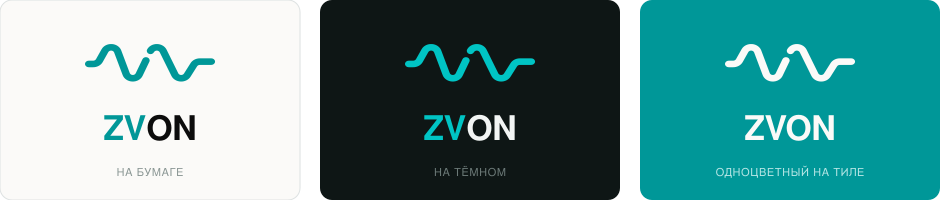
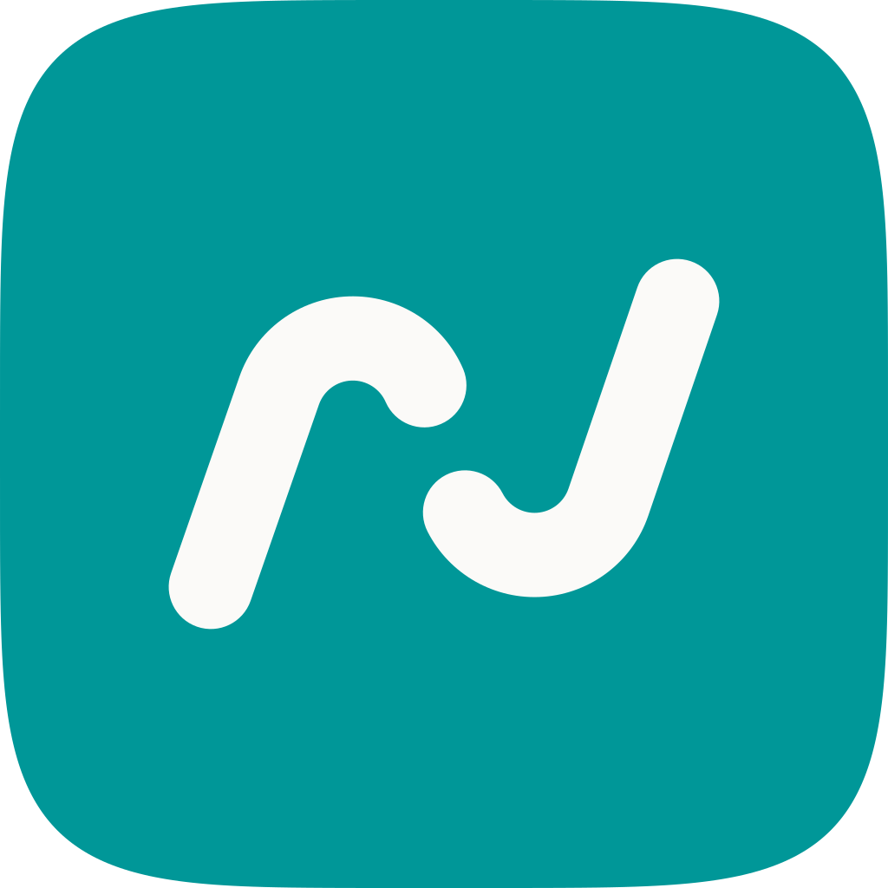
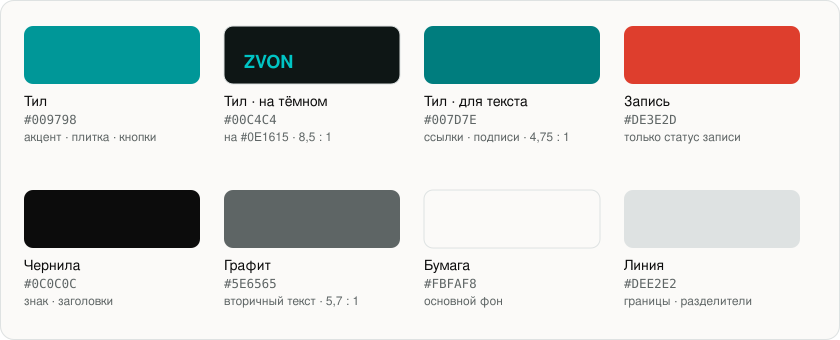

  

# Брендбук ZVON

Версия 1.0 · знак, иконка, цвет, шрифт

Волна — один штрих постоянной толщины, один радиус во всех шести углах, круглые торцы. Вход коротким импульсом слева, выход длинной спокойной линией справа: разговор превращается в результат. Разрыв посередине — два источника звука, ваш микрофон и голос собеседника. `ZV` выделено акцентом — это инициалы основателей; `ON` остаётся чернильным.

---

## 01 · Логотип

  

| Сборка | Размер | Где |
|---|---|---|
| **Вертикальная** (основная) | 1266 × 790 | сайт, презентации, крупные аватары |
| **Горизонтальная** | 1627 × 340 | шапка сайта, письма, узкие места |
| **На тёмном** | — | тёмные фоны (`zvon-logo-dark.svg`) |
| **Одноцветная** | — | печать, гравировка, тиснение, партнёрские страницы |

- **Охранное поле** — одна толщина штриха (64 единицы, ≈5 % ширины блока) со всех сторон. Внутрь не заходит ничего.
- **Минимальный размер** — сборка со словом от **120 px** по ширине; знак отдельно от **50 px**. Ниже разрыв затягивается — берите версию без разрыва.
- **Логотип — это файл, а не набранный шрифтом текст.** Набрать слово шрифтом и назвать это логотипом нельзя.

---

## 02 · Иконка

  &nbsp;&nbsp;
  &nbsp;&nbsp;
  &nbsp;&nbsp;
  

Волна, нарисованная под квадрат: период короче, амплитуда выше, хвосты убраны. Плитка — суперэллипс macOS; фигура занимает 62 % ширины, штрих 11 % плитки, радиус и разрыв в тех же пропорциях, что в логотипе. Один файл 1024 × 1024 на все размеры (64 · 44 · 32 · 16), три темы: `zvon-icon-light`, `zvon-icon-dark`, а для tinted-режима Sequoia — одноцветный `zvon-icon-glyph` без плитки.

- **Меню-бар** — шаблонный глиф с разрывом, пропорция 1,49 : 1. Система красит его сама: цвета в меню-баре нет, состояния показываются подложкой и таймером, а не цветом знака.
- **Favicon и аватар** — в квадратном формате всегда идёт фигура с разрывом. На 16 px разрыв сам сходится в линию — этого достаточно.

---

## 03 · Цвет

  

**Тил `#009798`** — основной цвет бренда: акцент в логотипе, плитка иконки, кнопки, ссылки. Он не занимает ни один системный статус: **красный `#DE3E2D` остаётся за записью**, зелёный — за успехом.

Про контраст: тил `#009798` на бумаге даёт **3,4 : 1** — этого достаточно для знака, плитки и крупных надписей, но мало для мелкого текста. Для ссылок и подписей берите **`#007D7E` (4,75 : 1)**, на тёмном — **`#00C4C4` (8,5 : 1)**. Так бренд остаётся одним цветом, но интерфейс не теряет читаемости.

> В приложении используется тёмная тема с той же тил-логикой (`#00C4C4` на `#0E1615`). Полная система токенов интерфейса — в [`Sources/UI/ParleyTheme.swift`](../Sources/UI/ParleyTheme.swift).

---

## 04 · Шрифт

**Onest** — интерфейс сайта, письма, документы продукта. Свободная лицензия SIL Open Font License, полная кириллица. → [Google Fonts](https://fonts.google.com/specimen/Onest)

**SF Pro** — внутри приложения. Системный шрифт macOS: бесплатный на платформе, родной вид интерфейса. Onest в приложение не тащим.

- Начертания: **400** для текста, **500** для акцентов и подписей, **600** для заголовков. Больше трёх не нужно.
- Логотип — не шрифт: `ZVON` в сборке нарисован и живёт как файл.

---

## 05 · Чего не делать

- **Не растягивать и не сжимать** — пропорции знака заданы геометрией.
- **Не перекрашивать акцент** — тил, чернила или один цвет целиком; других вариантов нет.
- **Не ставить на фото и градиенты** — только бумага, чернила, тил или тёмный.
- **Не уменьшать полный знак ниже 50 px** — для мелкого есть версия без разрыва.

---

## 06 · Файлы

Все исходники — в [`docs/brand/`](brand/).

| Сборки | Знак и одноцветные | Иконки | Мелкий размер |
|---|---|---|---|
| [`zvon-logo.svg`](brand/zvon-logo.svg) | [`zvon-mark.svg`](brand/zvon-mark.svg) | [`zvon-icon.svg`](brand/zvon-icon.svg) | [`zvon-icon-menubar.svg`](brand/zvon-icon-menubar.svg) |
| [`zvon-logo-dark.svg`](brand/zvon-logo-dark.svg) | [`zvon-mark-paper.svg`](brand/zvon-mark-paper.svg) | [`zvon-icon-light.svg`](brand/zvon-icon-light.svg) | [`zvon-icon-menubar-paper.svg`](brand/zvon-icon-menubar-paper.svg) |
| [`zvon-logo-horizontal.svg`](brand/zvon-logo-horizontal.svg) | [`zvon-logo-mono-ink.svg`](brand/zvon-logo-mono-ink.svg) | [`zvon-icon-dark.svg`](brand/zvon-icon-dark.svg) | [`zvon-favicon.svg`](brand/zvon-favicon.svg) |
| [`zvon-logo-horizontal-dark.svg`](brand/zvon-logo-horizontal-dark.svg) | [`zvon-logo-mono-paper.svg`](brand/zvon-logo-mono-paper.svg) | [`zvon-icon-glyph.svg`](brand/zvon-icon-glyph.svg) | |
